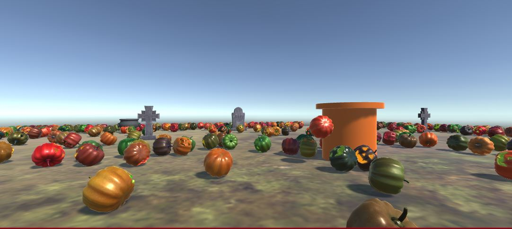

## Portfolio

---

### Projects

[Tuffy Track](https://jenniferafelton.github.io/TuffyTrack/)  
TuffyTrack is a group project I worked on for Spring 2020 Software Development with Open Source class at California State Fullerton. The requirements were for a group of 2-3 students to make a project using Open Source Software, using existing Open Source software and code written by our group. It must use CASE tools, version control software, and include documentation.      
<(https://youtu.be/PpVLFv9TMiA "Tuffy Track")> 

---
[Halloween Pumpkin Punter](https://jenniferafelton.github.io/Pumpkin_Punter/)  
Pumpkin Punter is based upon a group project from IESD. The goal is to reach all the tombstones while kicking pumpkins out of the way. I learned to create assets with actions and to create a custom first person camera that interacts with the environment.    
 

---

---

### Publications

- [Reducing the Gender Gap in Computer Science Field](https://docs.google.com/document/d/1boJjuz_EXl5NysF5Fk5IctrHRzbRVXD45aqqCzaP4W8/edit?usp=sharing) 
  >This is the final paper for the anthropology elective I took. By examining the factors that contribute to this gender gap, steps can be taken to minimize them and encourage more women to choose the computer science field. 	 

- [Geologic Treasure at the End of the Rainbow](https://docs.google.com/document/d/1YBmk2dLzxUQRxbssDXbBetKHuiNFJ9vJGA-3pGm-EzA/edit?usp=sharing) 
  > My final Geology Paper from Geologic Field Studies. The assignment was challenging because it was limited to two pages.   

- [Pokerrrr2 Software Requirements Specification](https://docs.google.com/document/d/1dtXXftm29LFOv6M2zyZtUYGKYGc5uqRH2yOWjhkd8Fc/edit?usp=sharing) 
  > Group SRS on an existing App, Pokerrrr2.  

- [Hearthstore Software Requirements Specification](https://docs.google.com/document/d/1gNrx6BBeK1yqtoQ-c8AUObGr73UY80jtXOv6hKtFbt8/edit?usp=sharing) 
  > Individual SRS on the Blizzard Hearthstone game.  

---

---
<!--
Page template forked from <a href="https://github.com/evanca/quick-portfolio">evanca</a>
 -->
<!-- Remove above link if you don't want to attibute -->
