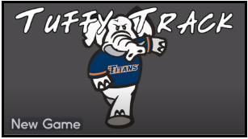

## Portfolio

---

### Projects

[Tuffy Track](https://jenniferafelton.github.io/TuffyTrack/)  
TuffyTrack is a group project I worked on for Spring 2020 Software Development with Open Source class at California State Fullerton. The requirements were for a group of 2-3 students to make a project using Open Source Software, using existing Open Source software and code written by our group. It must use CASE tools, version control software, and include documentation.  
  

---

---

---

### Publications

- [Synthetic Data for AI Training](https://jenniferafelton.github.io/pdf/Final_Draft_Colabborative_Paper_v3.pdf) 
  > Group paper considering the ethics of using Syntheic Data in AI training.  
  
- [Pokerrrr2 Software Requirements Specification](https://jenniferafelton.github.io/pdf/SRS_Final_Draft.pdf) 
  > Group SRS on an existing App, Pokerrrr2.  

- [Hearthstore Software Requirements Specification](https://jenniferafelton.github.io/pdf/Hearthstone_SRS.pdf) 
  > Individual SRS on the Blizzard Hearthstone game.  

- [Reducing the Gender Gap in Computer Science Field](https://jenniferafelton.github.io/pdf/Reducing_Gender_Gap_CS_Field.pdf) 
  > This is the final paper for the anthropology elective I took. By examining the factors that contribute to this gender gap, steps can be taken to minimize them and encourage more women to choose the computer science field. 	 

- [Geologic Treasure at the End of the Rainbow](https://jenniferafelton.github.io/pdf/Geologic Treasure at the End of the Rainbow.pdf) 
  > My final Geology Paper from Geologic Field Studies. The assignment was challenging because it was limited to two pages.   

---

---
<!--
Page template forked from <a href="https://github.com/evanca/quick-portfolio">evanca</a>
 -->
<!-- Remove above link if you don't want to attibute -->
